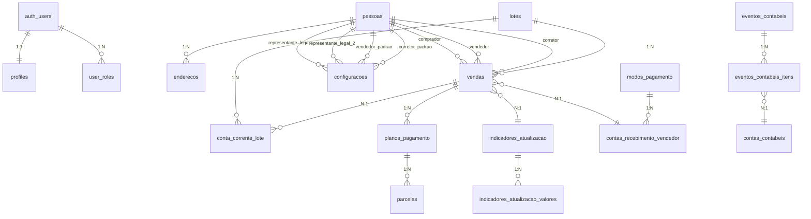

# Documentação do Banco de Dados - Sistema de Gestão de Lotes

## Diagrama de Relacionamentos (ER)



---

## 1. Controle de Usuários e Permissões

### 1.1 profiles
Armazena informações do perfil do usuário autenticado.

| Coluna | Tipo | Nullable | Default | Descrição |
|--------|------|----------|---------|-----------|
| **id** | uuid | Não | - | PK, referência ao auth.users |
| nome | text | Não | - | Nome do usuário |
| is_active | boolean | Sim | true | Status ativo/inativo |
| created_at | timestamptz | Sim | now() | Data de criação |
| updated_at | timestamptz | Sim | - | Data de atualização |

**Relacionamentos:**
- `id` → `auth.users.id` (1:1)

**RLS Policies:**
- Admins podem visualizar todos os perfis
- Usuários podem visualizar e atualizar apenas seu próprio perfil

---

### 1.2 user_roles
Define os papéis/permissões dos usuários no sistema.

| Coluna | Tipo | Nullable | Default | Descrição |
|--------|------|----------|---------|-----------|
| **id** | uuid | Não | gen_random_uuid() | PK |
| user_id | uuid | Não | - | FK para auth.users |
| role | app_role (enum) | Não | - | Papel: ADMIN, OPERADOR, CONSULTA |
| created_at | timestamptz | Sim | now() | Data de criação |

**Enum app_role:**
- `ADMIN` - Acesso total ao sistema
- `OPERADOR` - Pode criar/editar registros
- `CONSULTA` - Apenas visualização

**Relacionamentos:**
- `user_id` → `auth.users.id` (N:1)

**RLS Policies:**
- Admins podem gerenciar todos os papéis
- Usuários podem visualizar apenas seus próprios papéis

---

## 2. Configurações do Sistema

### 2.1 configuracoes
Armazena configurações globais e dados do vendedor principal.

| Coluna | Tipo | Nullable | Default | Descrição |
|--------|------|----------|---------|-----------|
| **id** | uuid | Não | gen_random_uuid() | PK |
| data_criacao_app | date | Sim | CURRENT_DATE | Data de início do sistema |
| vendedor_pessoa_id | uuid | Sim | - | FK Pessoa vendedora padrão |
| representante_legal_pessoa_id | uuid | Sim | - | FK Representante legal 1 |
| representante_legal_2_pessoa_id | uuid | Sim | - | FK Representante legal 2 |
| padrao_corretor_pessoa_id | uuid | Sim | - | FK Corretor padrão |
| padrao_percentual_corretagem | numeric | Sim | - | % corretagem padrão |
| banco | text | Sim | - | Nome do banco |
| agencia | text | Sim | - | Número da agência |
| conta_corrente | text | Sim | - | Número da conta corrente |
| chave_pix | text | Sim | - | Chave PIX |
| observacoes | text | Sim | - | Observações gerais |
| created_at | timestamptz | Sim | now() | Data de criação |
| created_by | uuid | Sim | - | Usuário que criou |
| updated_at | timestamptz | Sim | - | Data de atualização |
| updated_by | uuid | Sim | - | Usuário que atualizou |

**Relacionamentos:**
- `vendedor_pessoa_id` → `pessoas.id`
- `representante_legal_pessoa_id` → `pessoas.id`
- `representante_legal_2_pessoa_id` → `pessoas.id`
- `padrao_corretor_pessoa_id` → `pessoas.id`

---

### 2.2 modos_pagamento
Cadastro de modos de pagamento disponíveis.

| Coluna | Tipo | Nullable | Default | Descrição |
|--------|------|----------|---------|-----------|
| **id** | uuid | Não | gen_random_uuid() | PK |
| descricao | text | Não | - | Descrição do modo |
| ativo | boolean | Sim | true | Status ativo/inativo |
| created_at | timestamptz | Sim | now() | Data de criação |
| created_by | uuid | Sim | - | Usuário que criou |
| updated_at | timestamptz | Sim | - | Data de atualização |
| updated_by | uuid | Sim | - | Usuário que atualizou |

**Exemplo de valores:** PIX, Transferência Bancária, Boleto, Depósito

---

### 2.3 contas_recebimento_vendedor
Contas bancárias onde o vendedor recebe os pagamentos.

| Coluna | Tipo | Nullable | Default | Descrição |
|--------|------|----------|---------|-----------|
| **id** | uuid | Não | gen_random_uuid() | PK |
| descricao | text | Não | - | Descrição da conta |
| modo_pagamento_id | uuid | Sim | - | FK Modo de pagamento |
| detalhes | text | Sim | - | Dados bancários/PIX |
| ativo | boolean | Sim | true | Status ativo/inativo |
| created_at | timestamptz | Sim | now() | Data de criação |
| created_by | uuid | Sim | - | Usuário que criou |
| updated_at | timestamptz | Sim | - | Data de atualização |
| updated_by | uuid | Sim | - | Usuário que atualizou |

**Relacionamentos:**
- `modo_pagamento_id` → `modos_pagamento.id`

---

## 3. Cadastro de Pessoas (PF/PJ)

### 3.1 pessoas
Cadastro unificado de pessoas físicas e jurídicas.

| Coluna | Tipo | Nullable | Default | Descrição |
|--------|------|----------|---------|-----------|
| **id** | uuid | Não | gen_random_uuid() | PK |
| tipo | text | Não | - | 'PF' ou 'PJ' |
| nome_razao | text | Não | - | Nome/Razão Social |
| cpf_cnpj | text | Sim | - | CPF ou CNPJ |
| rg_ie | text | Sim | - | RG ou Inscrição Estadual |
| email | text | Sim | - | E-mail |
| telefone | text | Sim | - | Telefone |
| observacoes | text | Sim | - | Observações |
| created_at | timestamptz | Sim | now() | Data de criação |
| created_by | uuid | Sim | - | Usuário que criou |
| updated_at | timestamptz | Sim | - | Data de atualização |
| updated_by | uuid | Sim | - | Usuário que atualizou |

**Uso no sistema:**
- Compradores de lotes
- Vendedores
- Corretores
- Representantes legais

---

### 3.2 enderecos
Endereços vinculados às pessoas.

| Coluna | Tipo | Nullable | Default | Descrição |
|--------|------|----------|---------|-----------|
| **id** | uuid | Não | gen_random_uuid() | PK |
| pessoa_id | uuid | Sim | - | FK Pessoa |
| tipo | text | Sim | - | Residencial, Comercial, etc |
| principal | boolean | Sim | false | Endereço principal |
| logradouro | text | Sim | - | Rua/Avenida |
| numero | text | Sim | - | Número |
| complemento | text | Sim | - | Complemento |
| bairro | text | Sim | - | Bairro |
| cidade | text | Sim | - | Cidade |
| uf | text | Sim | - | Estado (UF) |
| cep | text | Sim | - | CEP |
| created_at | timestamptz | Sim | now() | Data de criação |
| created_by | uuid | Sim | - | Usuário que criou |
| updated_at | timestamptz | Sim | - | Data de atualização |
| updated_by | uuid | Sim | - | Usuário que atualizou |

**Relacionamentos:**
- `pessoa_id` → `pessoas.id` (N:1)

---

## 4. Indicadores de Atualização Monetária

### 4.1 indicadores_atualizacao
Cadastro de índices de correção monetária (IPCA, IGPM, etc).

| Coluna | Tipo | Nullable | Default | Descrição |
|--------|------|----------|---------|-----------|
| **id** | uuid | Não | gen_random_uuid() | PK |
| nome | text | Não | - | Nome do indicador |
| descricao | text | Sim | - | Descrição |
| periodicidade | text | Sim | - | Mensal, Anual, etc |
| regra | text | Sim | - | Regra de aplicação |
| ativo | boolean | Sim | true | Status ativo/inativo |
| created_at | timestamptz | Sim | now() | Data de criação |
| created_by | uuid | Sim | - | Usuário que criou |
| updated_at | timestamptz | Sim | - | Data de atualização |
| updated_by | uuid | Sim | - | Usuário que atualizou |

**Exemplo de valores:** IPCA, IGPM, Taxa Fixa 1%

---

### 4.2 indicadores_atualizacao_valores
Valores históricos dos indicadores por competência.

| Coluna | Tipo | Nullable | Default | Descrição |
|--------|------|----------|---------|-----------|
| **id** | uuid | Não | gen_random_uuid() | PK |
| indicador_id | uuid | Sim | - | FK Indicador |
| competencia | date | Não | - | Mês/Ano de referência |
| fator | numeric | Não | - | Fator de correção |
| created_at | timestamptz | Sim | now() | Data de criação |
| created_by | uuid | Sim | - | Usuário que criou |
| updated_at | timestamptz | Sim | - | Data de atualização |
| updated_by | uuid | Sim | - | Usuário que atualizou |

**Relacionamentos:**
- `indicador_id` → `indicadores_atualizacao.id` (N:1)

---

## 5. Estoque de Lotes

### 5.1 lotes
Cadastro de lotes disponíveis para venda.

| Coluna | Tipo | Nullable | Default | Descrição |
|--------|------|----------|---------|-----------|
| **id** | uuid | Não | gen_random_uuid() | PK |
| quadra | text | Não | - | Identificação da quadra |
| numero_lote | text | Não | - | Número do lote |
| etiqueta_patrimonial | text | Sim | - | Etiqueta patrimonial |
| matricula_ri | text | Sim | - | Matrícula no RI |
| area_m2 | numeric | Sim | - | Área em m² |
| custo_contabil | numeric | Sim | - | Custo contábil |
| status | text | Sim | 'DISPONIVEL' | Status do lote |
| observacoes | text | Sim | - | Observações |
| created_at | timestamptz | Sim | now() | Data de criação |
| created_by | uuid | Sim | - | Usuário que criou |
| updated_at | timestamptz | Sim | - | Data de atualização |
| updated_by | uuid | Sim | - | Usuário que atualizou |

**Status possíveis:**
- `DISPONIVEL` - Disponível para venda
- `VENDIDO` - Vendido
- `RESERVADO` - Reservado
- `BLOQUEADO` - Bloqueado

**Trigger:** Ao criar uma venda, o status é automaticamente alterado para `VENDIDO`

---

## 6. Vendas

### 6.1 vendas
Registro das vendas de lotes.

| Coluna | Tipo | Nullable | Default | Descrição |
|--------|------|----------|---------|-----------|
| **id** | uuid | Não | gen_random_uuid() | PK |
| lote_id | uuid | Não | - | FK Lote vendido |
| data_venda | date | Não | - | Data da venda |
| comprador_pessoa_id | uuid | Não | - | FK Comprador |
| vendedor_pessoa_id | uuid | Sim | - | FK Vendedor |
| corretor_pessoa_id | uuid | Sim | - | FK Corretor |
| percentual_corretagem | numeric | Sim | - | % de corretagem |
| valor_venda | numeric | Não | - | Valor total da venda |
| valor_arras | numeric | Sim | - | Valor do sinal/arras |
| indicador_atualizacao_id | uuid | Sim | - | FK Indicador correção |
| conta_recebimento_vendedor_id | uuid | Sim | - | FK Conta recebimento |
| status | text | Sim | 'ATIVA' | Status da venda |
| observacoes | text | Sim | - | Observações |
| created_at | timestamptz | Sim | now() | Data de criação |
| created_by | uuid | Sim | - | Usuário que criou |
| updated_at | timestamptz | Sim | - | Data de atualização |
| updated_by | uuid | Sim | - | Usuário que atualizou |

**Status possíveis:**
- `ATIVA` - Venda ativa
- `QUITADA` - Totalmente paga
- `INADIMPLENTE` - Com parcelas em atraso
- `CANCELADA` - Venda cancelada

**Relacionamentos:**
- `lote_id` → `lotes.id`
- `comprador_pessoa_id` → `pessoas.id`
- `vendedor_pessoa_id` → `pessoas.id`
- `corretor_pessoa_id` → `pessoas.id`
- `indicador_atualizacao_id` → `indicadores_atualizacao.id`
- `conta_recebimento_vendedor_id` → `contas_recebimento_vendedor.id`

**Trigger:** `update_lote_on_venda` - Atualiza status do lote automaticamente

---

## 7. Parcelamento e Controle de Pagamentos

### 7.1 planos_pagamento
Planos de pagamento vinculados às vendas.

| Coluna | Tipo | Nullable | Default | Descrição |
|--------|------|----------|---------|-----------|
| **id** | uuid | Não | gen_random_uuid() | PK |
| venda_id | uuid | Sim | - | FK Venda |
| tipo | text | Não | - | Tipo do plano |
| descricao | text | Sim | - | Descrição |
| created_at | timestamptz | Sim | now() | Data de criação |
| created_by | uuid | Sim | - | Usuário que criou |
| updated_at | timestamptz | Sim | - | Data de atualização |
| updated_by | uuid | Sim | - | Usuário que atualizou |

**Tipos de plano:**
- `PARCELAMENTO` - Parcelas mensais
- `REFORCO` - Parcelas de reforço (semestrais, anuais)

**Relacionamentos:**
- `venda_id` → `vendas.id` (N:1)

---

### 7.2 parcelas
Parcelas dos planos de pagamento.

| Coluna | Tipo | Nullable | Default | Descrição |
|--------|------|----------|---------|-----------|
| **id** | uuid | Não | gen_random_uuid() | PK |
| plano_id | uuid | Sim | - | FK Plano de pagamento |
| numero | integer | Não | - | Número da parcela |
| vencimento | date | Não | - | Data de vencimento |
| valor_principal | numeric | Não | - | Valor original |
| valor_atualizado | numeric | Sim | - | Valor corrigido |
| valor_pago | numeric | Sim | - | Valor efetivamente pago |
| data_pagamento | date | Sim | - | Data do pagamento |
| status | text | Sim | 'ABERTA' | Status da parcela |
| created_at | timestamptz | Sim | now() | Data de criação |
| created_by | uuid | Sim | - | Usuário que criou |
| updated_at | timestamptz | Sim | - | Data de atualização |
| updated_by | uuid | Sim | - | Usuário que atualizou |

**Status possíveis:**
- `ABERTA` - Aguardando pagamento
- `PAGA` - Quitada
- `VENCIDA` - Vencida e não paga
- `CANCELADA` - Cancelada

**Relacionamentos:**
- `plano_id` → `planos_pagamento.id` (N:1)

---

## 8. Conta Corrente do Lote

### 8.1 conta_corrente_lote
Movimentação financeira por lote (histórico de operações).

| Coluna | Tipo | Nullable | Default | Descrição |
|--------|------|----------|---------|-----------|
| **id** | uuid | Não | gen_random_uuid() | PK |
| lote_id | uuid | Não | - | FK Lote |
| venda_id | uuid | Sim | - | FK Venda (opcional) |
| data_mov | date | Não | - | Data do movimento |
| tipo_mov | text | Não | - | Tipo do movimento |
| descricao | text | Sim | - | Descrição |
| referencia | text | Sim | - | Referência/competência |
| credito | numeric | Sim | 0 | Valor de crédito |
| debito | numeric | Sim | 0 | Valor de débito |
| saldo | numeric | Sim | - | Saldo após movimento |
| vencimento | date | Sim | - | Data de vencimento |
| percentual_calculo | numeric | Sim | - | % utilizado no cálculo |
| created_at | timestamptz | Sim | now() | Data de criação |
| created_by | uuid | Sim | - | Usuário que criou |
| updated_at | timestamptz | Sim | - | Data de atualização |
| updated_by | uuid | Sim | - | Usuário que atualizou |

**Tipos de movimento:**
- `VENDA` - Registro da venda
- `PARCELA` - Recebimento de parcela
- `REFORCO` - Recebimento de reforço
- `CORRECAO` - Correção monetária
- `COMISSAO` - Pagamento de comissão
- `DESPESA` - Outras despesas
- `ESTORNO` - Estorno de valor

**Relacionamentos:**
- `lote_id` → `lotes.id` (N:1)
- `venda_id` → `vendas.id` (N:1, opcional)

---

## 9. Views (Resumos e Totalizações)

### 9.1 vw_resumo_operacoes_lote
Resumo das operações agrupadas por lote e competência.

| Coluna | Tipo | Descrição |
|--------|------|-----------|
| lote_id | uuid | ID do lote |
| quadra | text | Quadra |
| numero_lote | text | Número do lote |
| competencia | date | Mês/Ano de referência |
| total_creditos | numeric | Total de créditos |
| total_debitos | numeric | Total de débitos |
| saldo_periodo | numeric | Saldo do período |

---

### 9.2 vw_totalizacao_mensal_por_lote
Totalização mensal por lote.

| Coluna | Tipo | Descrição |
|--------|------|-----------|
| lote_id | uuid | ID do lote |
| quadra | text | Quadra |
| numero_lote | text | Número do lote |
| competencia | date | Mês/Ano de referência |
| total_creditos | numeric | Total de créditos |
| total_debitos | numeric | Total de débitos |
| saldo_final | numeric | Saldo final |

---

### 9.3 vw_totalizacao_mensal_consolidada
Totalização mensal consolidada (todos os lotes).

| Coluna | Tipo | Descrição |
|--------|------|-----------|
| competencia | date | Mês/Ano de referência |
| total_creditos | numeric | Total de créditos |
| total_debitos | numeric | Total de débitos |
| saldo_final | numeric | Saldo final |

---

## 10. Módulo de Contabilidade

### 10.1 contas_contabeis
Plano de contas contábeis.

| Coluna | Tipo | Nullable | Default | Descrição |
|--------|------|----------|---------|-----------|
| **id** | uuid | Não | gen_random_uuid() | PK |
| codigo | text | Não | - | Código da conta |
| descricao | text | Não | - | Descrição da conta |
| ativo | boolean | Sim | true | Status ativo/inativo |
| created_at | timestamptz | Sim | now() | Data de criação |
| created_by | uuid | Sim | - | Usuário que criou |
| updated_at | timestamptz | Sim | - | Data de atualização |
| updated_by | uuid | Sim | - | Usuário que atualizou |

**Exemplo:** 1.1.01 - Caixa, 1.1.02 - Bancos, 3.1.01 - Receita de Vendas

---

### 10.2 eventos_contabeis
Eventos/lançamentos contábeis padrão.

| Coluna | Tipo | Nullable | Default | Descrição |
|--------|------|----------|---------|-----------|
| **id** | uuid | Não | gen_random_uuid() | PK |
| codigo | text | Não | - | Código do evento |
| descricao | text | Não | - | Descrição do evento |
| ativo | boolean | Sim | true | Status ativo/inativo |
| created_at | timestamptz | Sim | now() | Data de criação |
| created_by | uuid | Sim | - | Usuário que criou |
| updated_at | timestamptz | Sim | - | Data de atualização |
| updated_by | uuid | Sim | - | Usuário que atualizou |

**Exemplo:** 001 - Venda de Lote, 002 - Recebimento de Parcela

---

### 10.3 eventos_contabeis_itens
Partidas (débito/crédito) de cada evento contábil.

| Coluna | Tipo | Nullable | Default | Descrição |
|--------|------|----------|---------|-----------|
| **id** | uuid | Não | gen_random_uuid() | PK |
| evento_id | uuid | Sim | - | FK Evento contábil |
| conta_contabil_id | uuid | Sim | - | FK Conta contábil |
| dc | text | Não | - | 'D' (débito) ou 'C' (crédito) |
| historico_padrao | text | Sim | - | Histórico padrão |
| created_at | timestamptz | Sim | now() | Data de criação |
| created_by | uuid | Sim | - | Usuário que criou |
| updated_at | timestamptz | Sim | - | Data de atualização |
| updated_by | uuid | Sim | - | Usuário que atualizou |

**Relacionamentos:**
- `evento_id` → `eventos_contabeis.id` (N:1)
- `conta_contabil_id` → `contas_contabeis.id` (N:1)

---

## 11. Funções do Banco de Dados

### 11.1 has_role(user_id, role)
Verifica se um usuário possui determinado papel.

```sql
has_role(_user_id uuid, _role app_role) RETURNS boolean
```

**Uso:** Utilizada nas políticas RLS para controle de acesso.

---

### 11.2 handle_new_user()
Trigger executado ao criar novo usuário no auth.users.

**Ações:**
1. Cria registro na tabela `profiles`
2. Atribui papel `ADMIN` ao primeiro usuário
3. Atribui papel `CONSULTA` aos demais

---

### 11.3 update_lote_on_venda()
Trigger executado em operações na tabela `vendas`.

**Ações:**
- INSERT: Altera status do lote para `VENDIDO`
- UPDATE (status = CANCELADA): Altera status do lote para `DISPONIVEL`

---

## 12. Políticas de Segurança (RLS)

Todas as tabelas possuem Row Level Security (RLS) habilitado com as seguintes políticas padrão:

| Papel | Permissões |
|-------|------------|
| **ADMIN** | Acesso total (CRUD) em todas as tabelas |
| **OPERADOR** | Acesso CRUD nas tabelas operacionais |
| **CONSULTA** | Apenas visualização (SELECT) |

---

## 13. Auditoria

Todas as tabelas possuem campos de auditoria:

| Campo | Descrição |
|-------|-----------|
| created_at | Timestamp de criação |
| created_by | UUID do usuário que criou |
| updated_at | Timestamp da última atualização |
| updated_by | UUID do usuário que atualizou |

---

*Documentação gerada em: Janeiro/2026*
